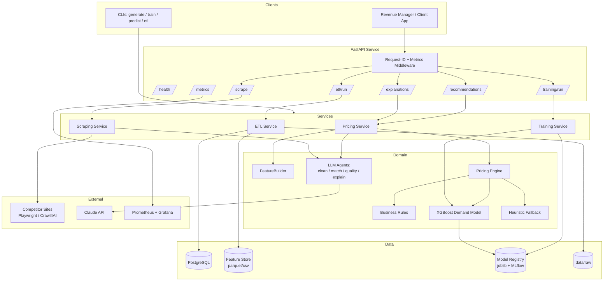
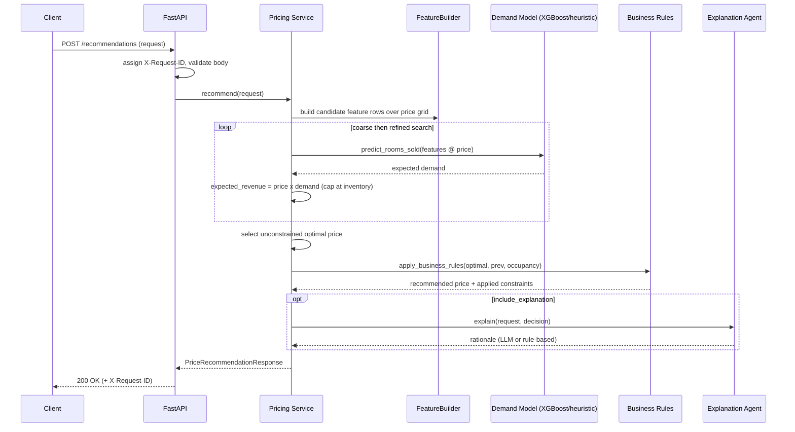
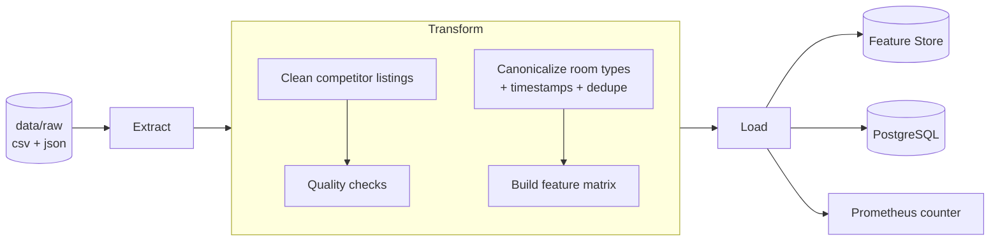
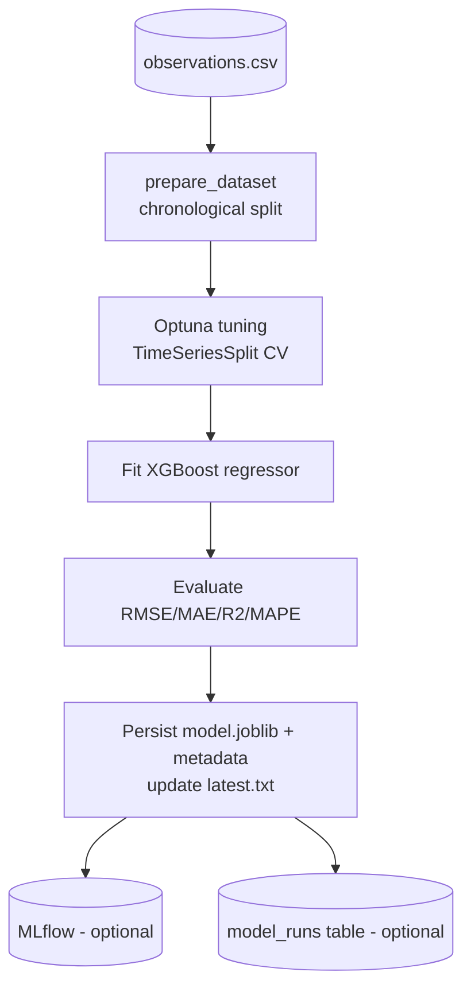

# Diagrams

Mermaid diagrams describing the system. They render automatically on GitHub.

## Component architecture

```mermaid
flowchart TB
    subgraph Clients
        UI[Revenue Manager / Client App]
        CLI[CLIs: generate / train / predict / etl]
    end

    subgraph API[FastAPI Service]
        MW[Request-ID + Metrics Middleware]
        R1[/health/]
        R2[/recommendations/]
        R3[/explanations/]
        R4[/scrape/]
        R5[/etl/run/]
        R6[/training/run/]
        R7[/metrics/]
    end

    subgraph Services
        PS[Pricing Service]
        TS[Training Service]
        SS[Scraping Service]
        ES[ETL Service]
    end

    subgraph Domain
        FE[FeatureBuilder]
        ENG[Pricing Engine]
        RULES[Business Rules]
        XGB[XGBoost Demand Model]
        HEUR[Heuristic Fallback]
        AG[LLM Agents:\nclean / match / quality / explain]
    end

    subgraph Data
        PG[(PostgreSQL)]
        FS[(Feature Store\nparquet/csv)]
        MODELS[(Model Registry\njoblib + MLflow)]
        RAW[(data/raw)]
    end

    subgraph External
        SCRAPE[Competitor Sites\nPlaywright / Crawl4AI]
        CLAUDE[Claude API]
        PROM[Prometheus + Grafana]
    end

    UI --> MW
    CLI --> Services
    MW --> R2 --> PS
    MW --> R3 --> PS
    MW --> R4 --> SS
    MW --> R5 --> ES
    MW --> R6 --> TS
    R7 --> PROM

    PS --> ENG
    ENG --> XGB
    ENG --> HEUR
    ENG --> RULES
    PS --> FE
    PS --> AG
    TS --> XGB
    TS --> MODELS
    SS --> SCRAPE
    SS --> AG
    ES --> RAW
    ES --> FS
    ES --> PG
    AG --> CLAUDE
    XGB --> MODELS
```

## Recommendation sequence

```mermaid
sequenceDiagram
    participant C as Client
    participant API as FastAPI
    participant PS as Pricing Service
    participant FB as FeatureBuilder
    participant M as Demand Model (XGBoost/heuristic)
    participant BR as Business Rules
    participant EX as Explanation Agent

    C->>API: POST /recommendations (request)
    API->>API: assign X-Request-ID, validate body
    API->>PS: recommend(request)
    PS->>FB: build candidate feature rows over price grid
    loop coarse then refined search
        PS->>M: predict_rooms_sold(features @ price)
        M-->>PS: expected demand
        PS->>PS: expected_revenue = price x demand (cap at inventory)
    end
    PS->>PS: select unconstrained optimal price
    PS->>BR: apply_business_rules(optimal, prev, occupancy)
    BR-->>PS: recommended price + applied constraints
    opt include_explanation
        PS->>EX: explain(request, decision)
        EX-->>PS: rationale (LLM or rule-based)
    end
    PS-->>API: PriceRecommendationResponse
    API-->>C: 200 OK (+ X-Request-ID)
```

## ETL pipeline

```mermaid
flowchart LR
    RAW[(data/raw\ncsv + json)] --> EX[Extract]
    EX --> TR[Transform]
    subgraph TR[Transform]
        direction TB
        CLEAN[Clean competitor listings] --> QUALITY[Quality checks]
        NORM[Canonicalize room types\n+ timestamps + dedupe] --> FEAT[Build feature matrix]
    end
    TR --> LD[Load]
    LD --> FS[(Feature Store)]
    LD --> PG[(PostgreSQL)]
    LD --> METRIC[Prometheus counter]
```

## Offline training

```mermaid
flowchart TB
    OBS[(observations.csv)] --> PREP[prepare_dataset\nchronological split]
    PREP --> TUNE[Optuna tuning\nTimeSeriesSplit CV]
    TUNE --> FIT[Fit XGBoost regressor]
    FIT --> EVAL[Evaluate RMSE/MAE/R2/MAPE]
    EVAL --> PERSIST[Persist model.joblib + metadata\nupdate latest.txt]
    PERSIST --> MLF[(MLflow - optional)]
    PERSIST --> DBRUN[(model_runs table - optional)]
```
